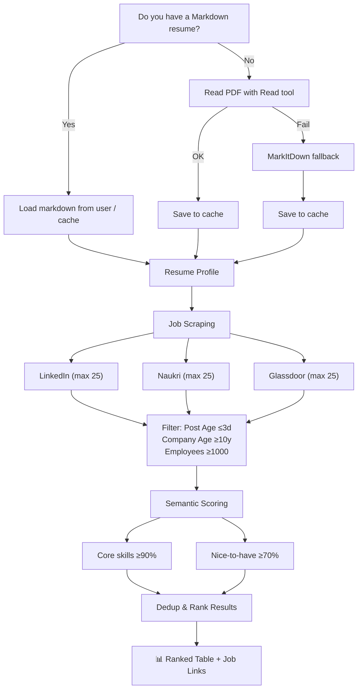

# 🎯 Find Your Job — AI-Powered Job Matcher

> **Scrape LinkedIn, Naukri & Glassdoor → Match against your resume → Get scored results in seconds.**

[](https://opencode.ai)
[](https://github.com)

---

## ✨ What It Does

**Find Your Job** is an [OpenCode](https://opencode.ai) skill that automates the full job-hunting workflow:

1. **🔍 Scrapes** live job listings from **LinkedIn**, **Naukri.com**, and **Glassdoor** (3 search profiles × 3 sites)
2. **📄 Reads** your resume PDF and builds a comprehensive **Resume Profile** (skills, experience, education, domains)
3. **🎯 Scores** every job using **semantic matching** — core requirements (≥90%) and nice-to-haves (≥70%)
4. **🧹 Deduplicates** identical listings across sites (keeps the best match)
5. **📊 Presents** a ranked table with job titles, companies, match scores, posting dates, and **direct apply links**
6. **💾 Saves** full results to `linkedin-jobs-matched.json` for future reference

---

## 🚀 Setup Guide — From Scratch

### 1. Install System Dependencies

```bash
# Python 3.10+ (required for MarkItDown)
python --version   # must be >= 3.10

# Node.js 18+ (required for OpenCode CLI)
node --version     # must be >= 18
```

### 2. Install OpenCode CLI

```bash
# macOS / Linux
curl -fsSL https://opencode.ai/install.sh | sh

# Windows (PowerShell)
iwr -useb https://opencode.ai/install.ps1 | iex

# Verify
opencode --version
```

### 3. Install Python Dependencies

The skill uses **MarkItDown** (Microsoft's document-to-Markdown converter) for PDF resume extraction:

```bash
pip install 'markitdown[pdf]'
```

For OCR-heavy PDFs (scanned documents), also install:

```bash
pip install markitdown-ocr openai
```

### 4. Install Playwright (for job scraping)

Playwright is used to automate browser interactions on LinkedIn, Naukri, and Glassdoor:

```bash
pip install playwright
playwright install chromium
```

> **Windows users**: If `playwright install chromium` fails, run PowerShell as Administrator and try again. You may also need `pip install playwright[windows]`.

### 5. Clone the Skill Repository

```bash
git clone https://github.com/<your-username>/SkillVault.git
```

Then copy the skill to OpenCode's skills directory:

```bash
# macOS / Linux
cp -r SkillVault/find-your-job ~/.config/opencode/skills/

# Windows (PowerShell)
Copy-Item -Recurse SkillVault\find-your-job ~\.config\opencode\skills\
```

### 6. Configure the Skill

Edit `~/.config/opencode/skills/find-your-job/job-matcher-config.json`:

```json
{
  "resume": "~/path/to/your-resume.pdf",
  "jobSites": ["linkedin", "naukri", "glassdoor"],
  "searches": [
    {
      "profile": "Your Desired Job Title",
      "linkedin": {
        "keywords": "DevOps Kubernetes Terraform",
        "locations": ["Bangalore", "Remote"],
        "filters": { "remote": true, "datePosted": "past_week" }
      },
      "naukri": {
        "keywords": "DevOps Engineer",
        "locations": ["Bangalore"],
        "filters": { "remote": true, "experience": "5-10" }
      },
      "glassdoor": {
        "keywords": "DevOps",
        "locations": ["Bangalore"],
        "filters": { "remote": true, "datePosted": "last_3_days" }
      }
    }
  ],
  "scoring": {
    "coreMatchThreshold": 90,
    "niceToHaveThreshold": 70
  },
  "companyEligibility": {
    "minAgeYears": 10,
    "minEmployees": 1000
  },
  "jobPostMaxDays": 3
}
```

### 7. Run It

Start an OpenCode session and tell your agent:

```
Find jobs matching my resume on LinkedIn, Naukri, and Glassdoor
```

The skill will:
1. Ask if you have a Markdown resume — or extract from your PDF
2. Scrape all three job sites
3. Score and rank results
4. Present a table with direct apply links

---

## ⚙️ Configuration Walkthrough

| Field | What it does |
|-------|-------------|
| `resume` | Path to your resume PDF. `~` is resolved to your home directory. |
| `jobSites` | Which sites to scrape. Remove any you don't want. |
| `searches[].profile` | Human label for the search (e.g., "Senior DevOps Engineer"). Appears in output. |
| `searches[].linkedin.keywords` | Keywords for LinkedIn search. |
| `searches[].linkedin.locations` | Location filter for LinkedIn. Add `"Remote"` for remote jobs. |
| `searches[].linkedin.filters.remote` | `true` = remote only. Omit or set `false` to include all. |
| `searches[].linkedin.filters.datePosted` | `"past_week"`, `"past_24_hours"`, or `"past_month"`. |
| `searches[].naukri` / `glassdoor` | Same structure per site. Site-specific filters may differ. |
| `scoring.coreMatchThreshold` | Minimum % required for core skills (default: 90). 0-100. |
| `scoring.niceToHaveThreshold` | Minimum % for nice-to-have skills (default: 70). 0-100. |
| `companyEligibility.minAgeYears` | Skip companies younger than this (default: 10). |
| `companyEligibility.minEmployees` | Skip companies smaller than this (default: 1000). |
| `jobPostMaxDays` | Ignore jobs older than this many days (default: 3). |

**Example: Entry-level / fresher config**
```json
{
  "scoring": { "coreMatchThreshold": 60, "niceToHaveThreshold": 40 },
  "companyEligibility": { "minAgeYears": 0, "minEmployees": 0 },
  "jobPostMaxDays": 30
}
```

**Example: Senior executive search**
```json
{
  "scoring": { "coreMatchThreshold": 95, "niceToHaveThreshold": 85 },
  "companyEligibility": { "minAgeYears": 15, "minEmployees": 5000 },
  "jobPostMaxDays": 7
}
```

---

## ⚙️ How It Works



---

## 🧠 Smart Matching Features

| Feature | Description |
|---------|-------------|
| **Semantic equivalence** | "5+ years" ≈ "6 years", "React.js" ≈ "React" |
| **Partial skill credit** | Related/broader skills get 70%+ match weight |
| **Experience tolerance** | Within 1 year counts as full match |
| **Generous parsing** | Generic fluff ("team player") ignored |
| **Company eligibility** | Filters by min age (10 yrs) and size (1000 emp) |
| **Cross-site dedup** | Same job on LinkedIn + Naukri = kept once (best score) |

---

## 📁 File Structure

```
~/.config/opencode/skills/find-your-job/
├── SKILL.md                    # Skill instructions (OpenCode reads this)
├── job-matcher-config.json     # Your search profiles & thresholds
├── linkedin-jobs-matched.json  # Output — results from last run
└── README.md                   # This file
```

---

## 🌐 Sites Supported

| Site | Login Required | Max Jobs/Profile | Anti-Scrape Notes |
|------|:---:|:---:|:---|
| **LinkedIn** | ✅ Yes | 25 | 2-4s delays, human-like scrolling |
| **Naukri.com** | ❌ No (better with) | 25 | 3-5s delays, CAPTCHA possible |
| **Glassdoor** | ✅ Recommended | 25 | 3-5s delays, aggressive bot detection |

---

## 📊 Sample Output

```
┌─────┬──────────────────────────────┬──────────────────┬───────┬───────┬──────────┬──────────┐
│  #  │ Job Title                    │ Company          │ Core% │ Nice% │ Posted   │ Source   │
├─────┼──────────────────────────────┼──────────────────┼───────┼───────┼──────────┼──────────┤
│  1  │ Senior DevOps Lead           │ Acme Corp        │  95%  │  80%  │ 2d ago   │ linkedin │
│  2  │ Platform Engineer            │ Beta Inc         │  92%  │  75%  │ 1d ago   │ naukri   │
│  3  │ Cloud Architect              │ Gamma Ltd        │  90%  │  72%  │ 2d ago   │ glassdoor│
└─────┴──────────────────────────────┴──────────────────┴───────┴───────┴──────────┴──────────┘

Job Links:
  1. https://www.linkedin.com/jobs/view/4418297213  (LinkedIn)
  2. https://www.naukri.com/job/12345  (Naukri)
  3. https://www.glassdoor.co.in/Job/12345  (Glassdoor)
```

---

## 🤝 Contributing

Found a bug? Want to add a job site? Open an issue or PR on the repo.

---

## 📝 License

MIT — free to use, modify, and share.
